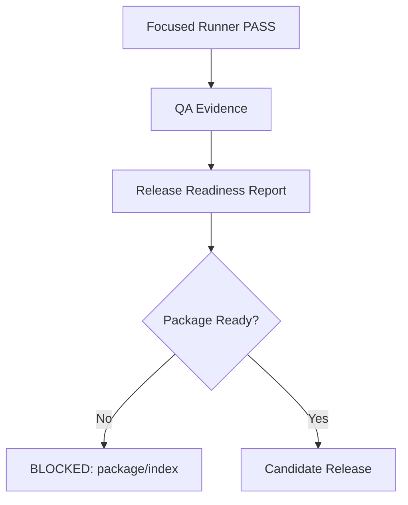

# Public API visual tooling demo

이 문서는 QuickChart, Kroki, Shields, xColors 계열 적용 smoke sample입니다.
게임 runtime에는 연결하지 않고 docs/QA/release 보조용으로만 사용합니다.

## Shields badges

- Gate0: https://img.shields.io/badge/Gate0-PASS-brightgreen.svg?style=flat

- Package: https://img.shields.io/badge/Package-BLOCKED-red.svg?style=flat

- Runtime Evidence: https://img.shields.io/badge/Runtime%20Evidence-PASS-brightgreen.svg?style=flat

- Public Release: https://img.shields.io/badge/Public%20Release-BLOCKED-orange.svg?style=flat

## QuickChart

URL: https://quickchart.io/chart?c=%7B%22type%22%3A%22bar%22%2C%22data%22%3A%7B%22labels%22%3A%5B%22Gate0%22%2C%22Runtime%22%2C%22Package%22%2C%22Public%22%5D%2C%22datasets%22%3A%5B%7B%22label%22%3A%22Release+readiness+sample%22%2C%22data%22%3A%5B65%2C12%2C2%2C1%5D%2C%22backgroundColor%22%3A%5B%22%232f6fed%22%2C%22%2324a148%22%2C%22%23f1c21b%22%2C%22%23da1e28%22%2C%22%238a3ffc%22%5D%7D%5D%7D%2C%22options%22%3A%7B%22title%22%3A%7B%22display%22%3Atrue%2C%22text%22%3A%22Release+readiness+sample%22%7D%2C%22legend%22%3A%7B%22display%22%3Afalse%7D%2C%22scales%22%3A%7B%22yAxes%22%3A%5B%7B%22ticks%22%3A%7B%22beginAtZero%22%3Atrue%2C%22precision%22%3A0%7D%7D%5D%7D%7D%7D

## Kroki Mermaid

URL: https://kroki.io/mermaid/svg/eNo9zUEOgjAQBdC9p5gLEPcuNKUtG40iuDFNFxNmgo2mEApGI95dCom7n_kv8-sO2xtc1ApAmKyphsAExeA9d5CLsrSQJFtIzVmAfjpiX7GdbDqfpSn4wRgYCkZynkOYUtt0fTRyNuqTY3XHejHv3XdqVGzGYzOCNunhJPdabaBd2Np54pf9qyuHETIj0ZMj7OObedL-ANJkOe4

Source:

## xColors / local palette fallback

public-apis의 xColors 링크는 2026-05-05 기준 Heroku `No such app` 응답이라 직접 의존하지 않습니다.
대신 동일 목적의 palette adapter를 로컬 fallback으로 적용했습니다.

| token | hex | usage |
|---|---:|---|
| safe | `#24a148` | low risk / pass |
| watch | `#f1c21b` | warning / review |
| danger | `#da1e28` | high risk / blocked |
| counter | `#ff832b` | counter forecast |
| focus | `#2f6fed` | selected unit / focus |

## Optional network availability check

- QuickChart: PASS — HTTP 200 image/png
- Kroki: PASS — HTTP 200 image/svg+xml
- Shields: PASS — HTTP 200 image/svg+xml;charset=utf-8
- xColors: WARN — HTTPError: HTTP Error 404: Not Found
